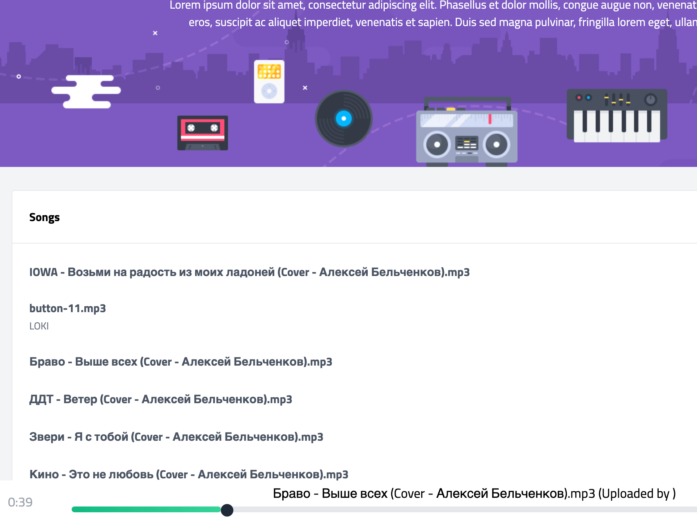

# Vuex Music

> Build an app "Vuex Music" on (Vue3, TailwindCSS, SASS, Firebase, Jest, Cypress, Vercel, Vuex, i18n, PWA)

### [Demo](https://vuex-music-ab.vercel.app)

### Preview


## Project setup
```
npm install
```

### Compiles and hot-reloads for development
```
npm run serve
```

### Compiles and minifies for production
```
npm run build
```

### Run your unit tests
```
npm run test:unit
```

### Run your end-to-end tests
```
npm run test:e2e
```

### Lints and fixes files
```
npm run lint
```
